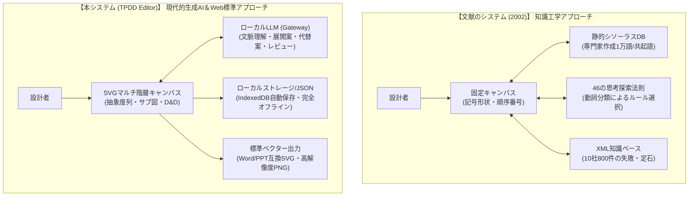

# 文献「機械設計支援システム」との差異分析書

本書は、アップロードされた学術文献**「思考過程の思考展開図表現に基づく機械設計支援システム」**（間瀬 久雄, 絹川 博之, 森井 洋, 中尾 政之, 畑村 洋太郎 著, 人工知能学会論文誌 Vol.17 No.1, 2002年）で提案されたシステムと、本リポジトリで開発・実装されている**「思考展開図エディタ」（Thinking Process Development Diagram Editor / TPDD Editor）**との機能、アーキテクチャ、発想支援アプローチ、UI/UX、技術基盤における差異を詳細に比較・整理した文書です。

---

## 1. 比較対象の概要

| 項目 | 文献記載のシステム (2002年) | 本システム「思考展開図エディタ（TPDD Editor）」 (2026年) |
|---|---|---|
| **論文・名称** | 思考過程の思考展開図表現に基づく機械設計支援システム (Mase et al., 2002) | Thinking Process Development Diagram Editor (TPDD Editor) |
| **開発主体・背景** | 日立製作所 システム開発研究所、東京電機大学、東京大学（畑村研究室・中尾研究室） | フロントエンド完結型 思考展開図エディタ |
| **時代背景** | ナレッジマネジメント（知識管理）、エキスパートシステム、自然言語処理（辞書・共起語） | 現代Web標準（React/TypeScript/SVG）、ローカル生成AI（LLM）、ローカルファースト |
| **対象ドメイン** | 主に機械設計分野（将来的に建築・電気等への拡張を志向） | ドメイン非依存（機械、ソフトウェア、システム設計、要求分析、業務企画全般） |
| **システム形態** | Windows専用GUIクライアント + 専門辞書・XML知識ベースサーバー | ブラウザ完結型SPA (Single Page Application) + 軽量ローカルLLM Gateway |

---

## 2. 設計思想の継承点（共通する基本理念）

本システム（TPDD）は、畑村・中尾・間瀬らによる「思考展開図」の先駆的理論を直接のルーツとしており、以下の基本理念を忠実に継承しています。

1. **要求・機能・機構・構造の脈絡付け**:
   - 設計作業を単なる図面引きではなく、「要求／機能（何をしたいか）」「機構（どうやって実現するか）」「構造（具体的にどう配置・作成するか）」の間の論理的な関係づけ（脈絡付け）として捉える点。
2. **思考スパイラルの許容（非線形な発想）**:
   - 要求→機能→機構→構造という左から右への順序を強制せず、具体物（機構や構造）からひらめいて上位機能へ遡ったり、中間の機構から発想を開始したりする試行錯誤の自由度を保証する点。
3. **ノード＆リンクによる思考の視覚化**:
   - アイデアや検討事項をノード（概念）とリンク（関係性）のグラフ構造として表出化し、思考の整理度を一覧可能にする点。
4. **結論だけでなく「思考過程」を記録する技術伝承**:
   - 最終的に採用された結論だけでなく、検討の経緯、棄却された代替案、意思決定の根拠を記録し、設計ノウハウを伝承する点。

---

## 3. 主要アーキテクチャ・アプローチの根本的な差異

### ① 知識・発想支援のパラダイムシフト（知識工学 vs 生成AI）
- **文献システム**:
  - **人手で構築した静的辞書・ルールベース**: 専門家40人が作成した「技術用語シソーラス（10,276語）」「機能表現語動詞ツリー（2,084語）」、特許公報・新聞から抽出した「共起語」、および企業10社から収集した「800件のXML知識ベース（失敗事例・定石）」を使用。
  - **課題**: 辞書構築・保守に膨大なコストがかかり、機械工学以外の分野への適用が極めて困難。キーワードアンマッチや連想の発散が発生しやすい。
- **本システム (TPDD Editor)**:
  - **ローカルLLM（大規模言語モデル）の動的推論**: 固定データベースは保持せず、現代のLLM（Gemma, Llama, Qwen等）が事前学習で持つ膨大な工学・物理・IT知識と文脈理解能力を活用。
  - **柔軟性**: 選択したノードとその近傍関係（1-hop）を構造化コンテキストとして渡し、「展開案生成」「代替案提示」「図全体の論理整合性レビュー」をオンデマンドに生成。専門分野の辞書登録なしにあらゆるドメインに即応可能。

### ② クライアント・サーバー構成とプライバシー保護
- **文献システム**:
  - 専用のWindowsデスクトップGUIアプリと、社内LAN上の知識ベースサーバー・ファイル共有を前提とする。
- **本システム (TPDD Editor)**:
  - **完全フロントエンド完結 (Pure SPA)**: ブラウザ単体で完結動作し、サーバー側DBや外部クラウドへのデータ送信は一切不要。
  - **機密保護 (Zero-Leakage)**: 社外秘の設計アイデアを保護するため、LLM Gatewayはローカル（`127.0.0.1:8765`）に限定接続可能。API Tokenはメモリ内（Reactステート）にのみ保持し、永続化ストレージやログ、プロジェクトファイルへ一切保存しない安全設計。

---

## 4. 論文で提示された「5大基本機能」との詳細対比

文献の第3章で詳述されている5つの基本機能と、本システム（TPDD）の機能対比は以下の通りです。

### 4.1 (1) 設計者の思考整理機能

| 比較観点 | 文献の機械設計支援システム | 本システム (TPDD Editor) | 差異と進化 |
|---|---|---|---|
| **ノード種別の表現** | **ノード枠の形状**で識別 ・要求/機能: 角丸四角形 ・機構: 長方形 ・構造: 二重四角形 ・制約条件: 二重角丸四角形 ・思考探索法則: 六角形 | **抽象度列 (Levels) + カラーバッジ** ・要求/機能/機構/構造: 明示的な縦列カラム ・種別に応じたソフトパステル配色と種別バッジ ・制約/メモ: 独立ノード種別 | 文献はキャンバス上に混在配置するが、本システムは「抽象度列」により左から右への階層構造を視覚的に自動整列・維持。列数（1〜12列）も自由に追加・カスタマイズ可能。 |
| **図面の肥大化防止** | 1つの巨大な図面内に全要素を記述 | **階層化サブ図 (Sub-Diagram)** 親ノード内に詳細な子図を作成し、パンくずリストで階層間を直感的に行き来可能 | 複雑なシステムにおいて1枚の図面が過密になるのを防ぎ、大規模設計を綺麗にモジュール化・カプセル化可能。 |
| **思考順序の表現** | ノード右下に**生成順序番号 ($T_a, T_b, \dots$)** を自動付与して表示 | **タイムスタンプ付きProvenanceメタデータ** + **純粋関数型Undo/Redo (50件)** | 画面上の数字刻印による視覚的ノイズを避け、各ノードの内部属性として作成日時・作成元（手動/AI）・利用モデルIDを詳細に記録。 |
| **メモ・ポンチ絵** | ノードにピン留めアイコンを表示し、外部ファイルのパスをリンク | **詳細説明文（最大2,000 Unicodeコードポイント）** + **タグ・参考Webリンク管理** | テキスト・URLを直接データ内に埋め込み管理。外部ファイルリンク切れの心配を排除。 |
| **採否の表現** | 最終採用ノード/リンクを**太線**で描画 | **ノード状態 (NodeStatus)** `draft` (実線枠) / `candidate` (破線枠) / `adopted` (太線枠) / `rejected` (半透明点線) | 採用/不採用だけでなく、「AIからの提案検討中（候補）」などのステータスを多段階で明確に視覚化。 |

### 4.2 (2) 設計者の発想支援機能

| 比較観点 | 文献の機械設計支援システム | 本システム (TPDD Editor) | 差異と進化 |
|---|---|---|---|
| **発想支援の方式** | **辞書引き・言葉の連想** ・技術用語シソーラス (手作業1万語) ・特許/記事共起語シソーラス ・機能表現語シソーラス (動詞ツリー) | **生成AIによる文脈連動型アイデア生成** ・展開案生成 (`expand`) ・代替案提示 (`alternatives`) | 文献は単語単位の連想（例: 注射針→吸引する→排出する→掬う）にとどまり、発散しやすく文脈を解さない。本システムは図の文脈全体を解釈し、具体的かつ整合性のある複数のノード・エッジの組み合わせを直接提案する。 |
| **ドメイン適応性** | 機械工学分野に厳密に特化（他分野への拡張には数千〜数万語の手動辞書登録が必須） | ドメイン完全非依存（LLMの汎用知識により、機械、電気、IT、建築、ビジネスモデル等に無設定で適応） | 辞書メンテナンスのコストをゼロにし、クロスドメインの課題にも即座に対応可能。 |

### 4.3 (3) 設計知識の提示機能

| 比較観点 | 文献の機械設計支援システム | 本システム (TPDD Editor) | 差異と進化 |
|---|---|---|---|
| **知識ソース** | 企業10社から収集した**800件のXML知識ベース**（定石・失敗事例） | **LLMの事前学習知識**（将来的な拡張としてRAGインターフェースを設計済み） | 過去事例の固定キーワード検索から、LLMの持つ広大な工学常識・不具合知識の直接活用へ移行。 |
| **検索・提示方式** | 動詞テンプレート検索（「〜で（対象物）を（動詞）する」に当てはめてXMLを検索） | フォーカスノードの課題に対する**具体的解決策・提案理由・前提条件・検証事項**を自然言語で構造化生成 | キーワード一致に頼らず、設計意図に即した知識をその場で論理的に構成して提示。 |

### 4.4 (4) 問題解決支援機能

| 比較観点 | 文献の機械設計支援システム | 本システム (TPDD Editor) | 差異と進化 |
|---|---|---|---|
| **対立・矛盾の解決** | **46種類の思考探索法則** （空間・物質・時間・作用・現象・制約の6大分類） 動詞上位グループと法則をマッピングして手動で絞り込み、事例を参照 | **AIによる図レビュー (`review`)** & **代替案生成** 設計上の背反・制約条件・冗長性・論理の飛躍を自動スキャンし、具体的な改善案を指摘 | 文献では設計者が提示された法則と事例を自分で解釈してあてはめる必要があったが、本システムではLLMが図面の関係性を読み取り、直接問題点と改善策を文章で指摘する。 |

### 4.5 (5) 技術伝承支援機能

| 比較観点 | 文献の機械設計支援システム | 本システム (TPDD Editor) | 差異と進化 |
|---|---|---|---|
| **思考過程の保存** | ノード生成番号（順序）の表示、外部メモ・ポンチ絵のパス保存 | **厳格検証する現行JSON形式（`.tpdd.json`）** + **IndexedDB自動保存** + **純粋関数履歴スタック** | 編集履歴がすべてデータとしてカプセル化され、別端末への受け渡しやバージョン管理（Git等）が容易。 |
| **成果物の出力** | システム画面上の印刷または独自ビューア | **標準SVGベクター出力** + **高解像度PNG画像出力** | 外部ツール（Word, PowerPoint, Figma, Illustrator等）で完全に編集・印刷可能な純粋ベクター出力（`<foreignObject>` を使用せず `<text>` / `<tspan>` で自前文字境界測定折り返しを実現）。 |

---

## 5. UI/UX・操作性とグラフィックス技術の差異

| 観点 | 文献の機械設計支援システム (2002) | 本システム「TPDD」 (2026) |
|---|---|---|
| **GUIプラットフォーム** | 2000年代初頭のWindowsデスクトップGUI（固定ウィンドウ、ダイアログ中心） | 現代的なWeb SPA（Tailwind CSS, レスポンシブ、モーダル、トースト通知） |
| **キャンバス操作** | スクロールバー移動、作図ボタンクリックによるモーダル遷移 | マウスホイールズーム（25%〜400%）、Space+ドラッグによる無段階パン |
| **複数選択と一括操作** | 単一ノード選択中心 | **ラバーバンド矩形選択**、**`Shift`+クリック**、**複数ノード一括ドラッグ移動**、**一括削除** |
| **結線操作 (エッジ作成)** | ツールバーの「リンク追加」ボタンを押してからノード間をクリック | **ノード端点ポート（○）からのドラッグ＆ドロップ結線** + ツールバーボタンの両立 |
| **ラベル編集** | ダイアログまたはプロパティ入力欄 | **キャンバス上でのインプレース直接編集（ダブルクリック / `F2`）**（IME保護対応） |
| **位置合わせ・整列** | 手動配置 | **キーボード矢印キーによる精密微調整 (1px / Shift+10px)** + **簡易自動レイアウト** |
| **大規模図面の描画性能** | 図面の拡大に伴い再描画負荷が増大（当時のハードウェア制約） | **ビューポート外カリング（仮想化）**: 画面外のSVG要素を自動スキップし、数百ノードでも軽快に動作 |

---

## 6. まとめ

文献（2002年）で提案された「思考展開図に基づく機械設計支援システム」は、**「設計とは要求・機能・機構・構造の間の脈絡付けである」**という極めて本質的かつ独創的な設計工学理論を世界に先駆けて具現化した先駆的研究でした。当時の技術的制約から、発想支援や問題解決には「40人の専門家による手作業の辞書」「固定的なXML知識ベース」「ルールベースの法則絞り込み」という知識工学的アプローチが採られていました。

これに対し、現代の**「思考展開図エディタ（TPDD Editor）」**は、その優れた設計哲学と図式表現モデルを継承しつつ、以下のように**25年分の情報技術・AI技術の進化を取り入れて再構築・発展**させたシステムと言えます。

1. **固定知識ベースから生成AI（LLM）への転換**:
   メンテナンスが困難な静的シソーラスを排し、ローカルLLMとの対話的推論によって、ドメインを問わず文脈に即した深い展開案・代替案・論理レビューを即座に引き出せるようにした点。
2. **Web標準・マルチ階層・ポータビリティの獲得**:
   専用クライアントやサーバー管理を不要にし、ブラウザ単体で高速・安全（完全オフライン＆Tokenメモリ保持）に動作。さらに「抽象度列」と「階層化サブ図」によって大規模な設計思考を整理可能にした点。
3. **Officeツールや外部環境との完全な相互運用性**:
   独自形式の囲い込みではなく、標準SVG（`<foreignObject>` 排除）やJSONを採用することで、Word、PowerPoint、Web等で自由に再利用・印刷・伝承できるようにした点。

本システムは、文献の目指した「設計者の思考を刺激し、失敗を防ぎ、技術を正しく伝承する」というゴールを、現代のエンジニアリング環境において最も実用的かつ洗練された形で実現しています。

